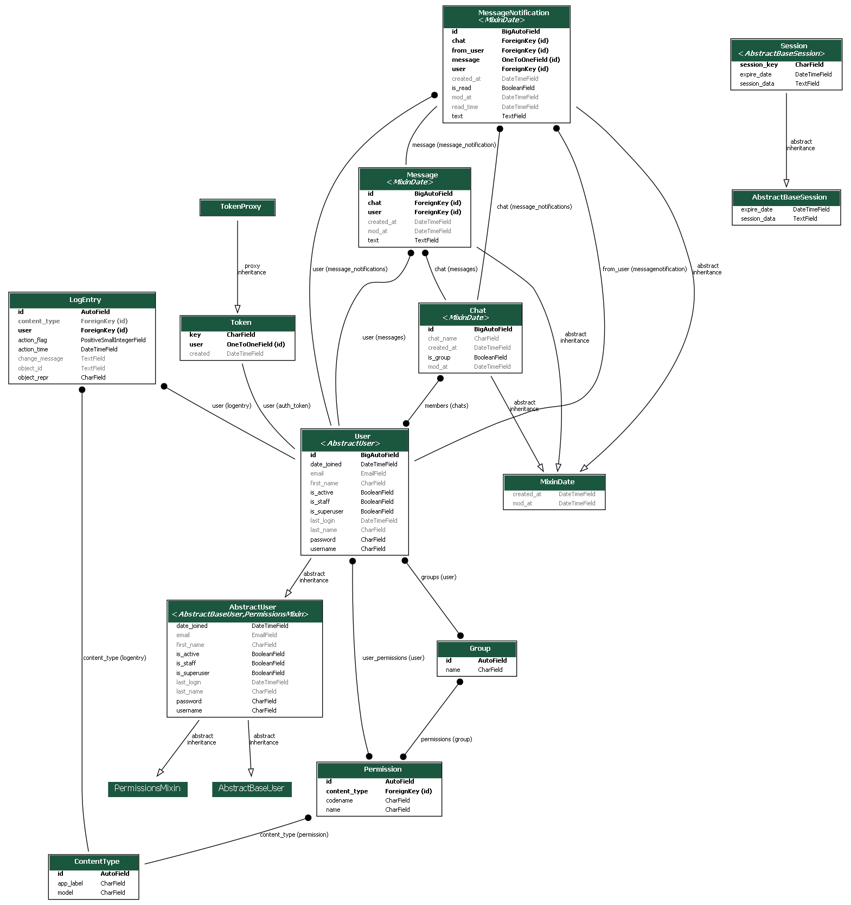

# CS50 Course Final project

## Chat app


### Why you believe your project satisfies the distinctiveness and complexity requirements?

This project utilizes ``Django Rest Framework`` for fetch calls from the frontend, and ``WebSockets`` with the ``Channels`` package, for live chat and notifications features.

### What’s contained in each file you created.
- [chat_project](chat_project/)
    -  Main root of the project, it contains the settings, and urls links.
    - Also contains the ``asgi`` file for routing the websocket calls to the consumers.
- [backend](backend/)
    - [migrations](backend/migrations/)
        - Database migrations.
    - [static](backend/static/)
        - Javascript for the [Vue.js](backend/static/js/app.js) app and all it's components. 
    - [tests](backend/tests/) contains all the tests for this app.
    - [admin.py](backend/admin.py) registered models to view/edit in the admins panel.
    - [apps.py](backend/apps.py) App config class, where the signals are called to enable it.
    - [consumers.py](backend/consumers.py) contains all the consumers for handling websocket messages using two packages called `djangochannelsrestframework` and `channelsmultiplexer`.
        - `MessageConsumer` it handles the creation of messages, join chat notifications, and handles the incomming messages for the two members of the chats.
        - `UserConsumer` **NOT USED**
        - `ChatConsumer` **NOT USED**
        - `MessageNotificationConsumer` it is used for getting a list of all notifications of the **current user**, making a notification as read and listening to notifications created by incomming messages in chats that the user is not in.
        - `DemultiplexerAsyncJson` it creates the stream for the incomming messages.
    - [models.py](backend/models.py)
        - `MixinDate` mixin for adding date fields to all models.
        - `User` extends from the django's `AbstractUser`.
        - `Chat` contains the members of the chat, this chat is unique for two members.
        - `Message` text sent by the user related to a specific chat.
        - `MessageNotification` contains information like the chat, message, user sent to, user from, if it was read and read time.
    - [routing.py](backend/routing.py) contains the websocket url patterns to the demultiplexer consumer.
    - [serializers.py](backend/serializers.py) contains the serializers for each of the models described above.
    - [signals.py](backend/signals.py) contains a signal to create a message notification when a message is received.
        - ``create_message_notification`` after a message is created, a message notification is created too.
    - [urls.py](backend/urls.py) contains the django rest framework router for each API endpoint.
    - [views.py](backend/views.py)
        - UserViewset:
            - list of the users.
            - detail of a user
            - delete a user
            - update a user
            - `current_chats` gets all the chats of the current user.
            - `contacts` gets all the contacts of a current user.
        - ChatViewset:
            - list of the chats
            - detail of a chat
            - delete a chat
            - update a chat
            - `create_chat_with` creates a chat with a specific user, if the chat doesn't exists, otherwise it returns that chat.
        - MessageViewset:
            - list of all messages
            - detail of a message
            - delete a message
            - update a message
            - `messages_in_chat` retrieves all the messages of a specific chat.
        - CurrentUserView returns the current user data.
        - login_view: renders the login page and handles the login post request.
        - logout_view: handles the logout request.
        - register: renders the register page, and handles the post register request.
            
- [templates](templates/)
    - index: contains the [Index page with the Vue.js app](templates/index.html) app.
    - layout: basic layout.
    - login: login page.
    - register: logout page.

### How to run your application.
``` cmd
> virtualenv venv
> venv/Scripts/activate
> (venv) pip install -r requirements.txt
> (venv) python manage.py migrate

Create two users or superusers
> (venv) python manage.py createsuperuser
> (venv) python manage.py createsuperuser
> (venv) python manage.py runserver
```

### Any other additional information the staff should know about your project.

This project utilizes four important packages for handling REST requests and WebSocket requests, this are:

- [Django Rest Framework](https://www.django-rest-framework.org/)
- [Django Channels v3](https://channels.readthedocs.io/en/stable/#)
- [Django channels rest framework](https://github.com/hishnash/djangochannelsrestframework)
- [Django channels multiplexer](https://github.com/hishnash/channelsmultiplexer)


### Models graph
